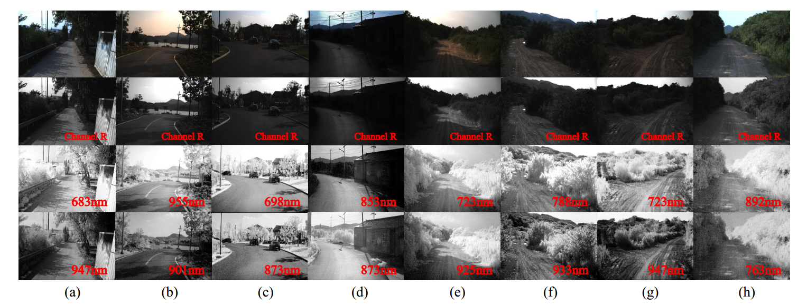

# HSI Road: A Hyper Spectral Image Dataset for Road Segmentation

Introduction
------------
This is the source code for our paper **HSI Road: A Hyper Spectral Image Dataset for Road Segmentation**

Dataset 
--------------------
The HSI Road dataset consists of 3799 scenes with not only RGB bands but also 25 NIR bands ranging from 600nm to 960nm, containing various kinds of road surfaces, including asphalt, cement, dirt and sand, under rural and natural scenes. The presented scenes are collected by a RGB camera and a NIR camera synchronously, which are fixed into a frame closely and equipped on our self-driving platform. Each group of images contains an RGB image, a hyper spectral image and a pixel mask, in which colored pixels represent road areas.
 
The purpose of building this dataset is:
    - providing RGB and NIR hyper spectral images in urban as well as rural scenes for road segmentation;
    - supplying a benchmark dataset to evaluate the performance of algorithms using hyper spectral images for road segmentation.

**Diversity**

This dataset contains two sorts of scenes:the urban scene and the rural scene. In urban scenes, city road with asphalt surface was collected and accounts for 23% of the dataset.The rural scenes consist of cement(17%) road surfaces in villages and dirt(21%) or sand(39%) road surfaces under natural scenes.


**Typical Road Scenes**

The typical road scenes of this dataset are as follows

among which (a),(b),(c) are in urban scenes and (d),(e),(f),(g),(h) are in rural scenes.The first row presents the picture of RGB images then follows with red channel at about 580nm.The third and last row represent NIR spectrums for identical scenes.

**Lisence**

This dataset is made freely available to academic and non-academic entities for non-commercial purposes such as academic research, teaching, scientific publications, or personal experimentation. Permission is granted to use the data given that you agree:

* That the dataset comes ¡°AS IS¡±, without express or implied warranty. Although every effort has been made to ensure accuracy, we do not accept any responsibility for errors or omissions.

* That you include a reference to the HSI Dataset in any work that makes use of the dataset. For research papers, cite our preferred publication as listed; for other media cite our preferred publication as listed.

* That you do not distribute this dataset or modified versions. It is permissible to distribute derivative works in as far as they are abstract representations of this dataset (such as models trained on it or additional annotations that do not directly include any of our data) and do not allow to recover the dataset or something similar in character.

* That you may not use the dataset or any derivative work for commercial purposes as, for example, licensing or selling the data, or using the data with a purpose to procure a commercial gain.

* That all rights not expressly granted to you are reserved by us.

How to use
------------
* **Data Preparation**

    - Download data into project root directory and uncompress them using
        ```
        wget https://hsiroad-sh.oss-cn-shanghai.aliyuncs.com/hsi_road.tar.gz
        tar -xvf hsi_road.tar.gz
        ```

* **Source Code**

    - If you want to train the whole network from begining using source code, please follow subsequent steps
    
      - Modify `model_cfgs` to the model you want to use in  ``` nir-fcn-mobilenet.yaml```
      - Modify `dataset_cfgs` to correct the data directory and collection in  ``` nir-fcn-mobilenet.yaml```
      - Modify `loss_cfgs` to the loss function you want to use in  ``` nir-fcn-mobilenet.yaml```
      - Modify `train_cfgs` to correct the gpu and learning parameters in  ``` nir-fcn-mobilenet.yaml```
 
      
      - Activate virtual environment(e.g. conda) and then run the script
       ```
       python train.py --config nir-fcn-mobilenet.yaml --ckpt_path [the directory you want to save the model to]
       ```

Citation
------------
 
If you find this useful in your research, please consider citing:
```
@inproceedings{lu2020HSI,
title={HSI Road: A Hyper Spectral Image Dataset for Road Segmentation},
author={Jiarou Lu, Huafeng Liu, Yazhou Yao, Shuyin Tao, Zhenmin Tang,Jianfeng Lu},
booktitle={IEEE International Conference on Multimedia and Expo (ICME)},
year={2020}
}
```
